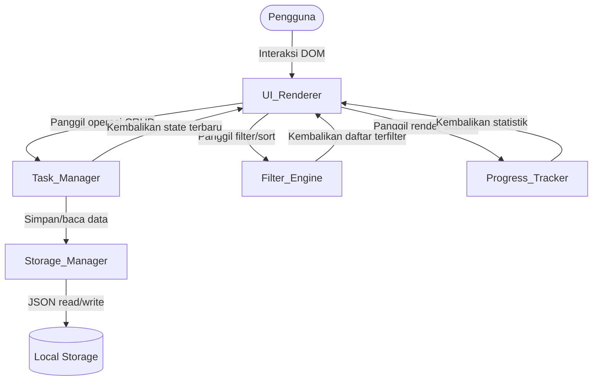
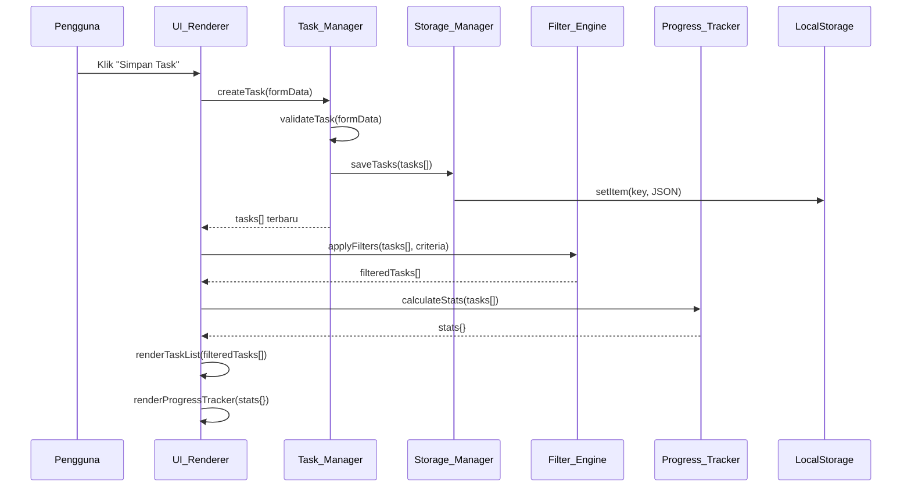

# Dokumen Desain Teknis: To-Do Life Dashboard

## Overview

To-Do Life Dashboard adalah aplikasi web satu halaman (*single-page application*) yang dibangun dengan HTML, CSS, dan Vanilla JavaScript murni — tanpa framework, tanpa build tool. Semua data disimpan secara persisten di sisi klien menggunakan browser Local Storage API.

Tujuan desain ini adalah menghasilkan arsitektur yang:
- **Modular** — setiap tanggung jawab dipisahkan ke dalam modul JavaScript yang berbeda di dalam satu file `js/app.js`.
- **Reaktif** — setiap perubahan state (tambah, edit, hapus, ubah status) langsung memperbarui UI dan Local Storage tanpa reload halaman.
- **Aksesibel** — menggunakan elemen HTML semantik dan mendukung navigasi keyboard penuh.
- **Responsif** — layout menyesuaikan diri antara tampilan satu kolom (mobile < 768px) dan multi-kolom (desktop ≥ 768px).

---

## Architecture

Aplikasi menggunakan pola **Module Pattern** berbasis IIFE (*Immediately Invoked Function Expression*) dan *closure* untuk enkapsulasi. Tidak ada dependensi eksternal. Semua modul berada dalam satu file `js/app.js` dan berkomunikasi melalui antarmuka publik yang terdefinisi.

### Diagram Arsitektur



### Alur Data Utama



---

## Struktur File dan Modul

```
project-root/
├── index.html          # Struktur HTML semantik, semua elemen UI statis
├── style.css           # Semua styling, variabel CSS, media queries
└── js/
    └── app.js          # Semua logika JavaScript (5 modul + inisialisasi)
```

### Pembagian Tanggung Jawab dalam `js/app.js`

| Modul | Tanggung Jawab |
|---|---|
| `Storage_Manager` | Baca/tulis JSON ke Local Storage |
| `Task_Manager` | Validasi, CRUD task, manajemen state `tasks[]` |
| `Filter_Engine` | Filter multi-kriteria dan pengurutan daftar task |
| `Progress_Tracker` | Kalkulasi statistik dan persentase penyelesaian |
| `UI_Renderer` | Render DOM, event listener, manajemen form dan dialog |

---

## Data Models

### Skema Objek Task

```javascript
{
  id:          string,   // UUID v4, dibuat saat task pertama kali disimpan
  title:       string,   // Wajib, 1–100 karakter
  description: string,   // Opsional, maks 500 karakter; default ""
  category:    string,   // Label bebas dari pengguna; default ""
  priority:    "low" | "medium" | "high",  // Wajib; default "medium"
  dueDate:     string | null,  // Format ISO 8601 "YYYY-MM-DD"; null jika tidak diisi
  status:      "pending" | "in-progress" | "completed",  // Default "pending"
  createdAt:   string    // ISO 8601 timestamp, dibuat saat task pertama kali disimpan
}
```

### Skema Local Storage

```
Key   : "todo-life-dashboard-tasks"
Value : JSON.stringify(Task[])
```

Contoh nilai yang tersimpan:

```json
[
  {
    "id": "a1b2c3d4-e5f6-7890-abcd-ef1234567890",
    "title": "Belajar JavaScript",
    "description": "Pelajari konsep closure dan prototype",
    "category": "Belajar",
    "priority": "high",
    "dueDate": "2025-07-01",
    "status": "in-progress",
    "createdAt": "2025-06-15T08:30:00.000Z"
  }
]
```

### Skema State Filter Aktif

State filter disimpan di memori (variabel modul), bukan di Local Storage:

```javascript
{
  status:   "semua" | "pending" | "in-progress" | "completed",
  priority: "semua" | "low" | "medium" | "high",
  category: "semua" | string,
  search:   string,   // teks pencarian, default ""
  sortBy:   "createdAt-desc" | "priority-desc" | "dueDate-asc" | "title-asc"
}
```

---

## Components and Interfaces

### Storage_Manager

```javascript
const Storage_Manager = (() => {
  const KEY = 'todo-life-dashboard-tasks';

  // Membaca dan mem-parse JSON dari Local Storage.
  // Mengembalikan [] jika key tidak ada, JSON tidak valid, atau struktur tidak sesuai.
  function loadTasks() { ... }

  // Menyimpan array task ke Local Storage sebagai JSON.
  // Melempar error jika operasi tulis gagal (misal: storage penuh).
  function saveTasks(tasks) { ... }

  return { loadTasks, saveTasks };
})();
```

**Aturan validasi saat `loadTasks`:**
- Jika `localStorage.getItem(KEY)` mengembalikan `null` → kembalikan `[]`
- Jika `JSON.parse` melempar exception → kembalikan `[]`
- Jika hasil parse bukan `Array` → kembalikan `[]`

### Task_Manager

```javascript
const Task_Manager = (() => {
  let tasks = [];  // State in-memory

  function init() { tasks = Storage_Manager.loadTasks(); }

  function createTask(data) { ... }   // Validasi → buat objek Task → simpan
  function updateTask(id, data) { ... } // Validasi → update task → simpan
  function deleteTask(id) { ... }     // Filter out → simpan
  function updateStatus(id) { ... }   // Siklus status → simpan
  function getTasks() { return [...tasks]; }

  return { init, createTask, updateTask, deleteTask, updateStatus, getTasks };
})();
```

**Aturan validasi `createTask` dan `updateTask`:**
- `title` tidak boleh kosong (setelah `.trim()`)
- `title.trim().length` tidak boleh melebihi 100 karakter
- `description.trim().length` tidak boleh melebihi 500 karakter
- `priority` harus salah satu dari `["low", "medium", "high"]`
- `status` harus salah satu dari `["pending", "in-progress", "completed"]`

**Siklus status `updateStatus`:**
```
pending → in-progress → completed → pending
```

**Pembuatan ID:** menggunakan `crypto.randomUUID()` (tersedia di semua modern browser).

### Filter_Engine

```javascript
const Filter_Engine = (() => {
  const PRIORITY_ORDER = { high: 3, medium: 2, low: 1 };

  // Menerima array task dan objek kriteria filter.
  // Mengembalikan array task baru yang sudah difilter dan diurutkan.
  function apply(tasks, criteria) {
    let result = [...tasks];
    result = filterByStatus(result, criteria.status);
    result = filterByPriority(result, criteria.priority);
    result = filterByCategory(result, criteria.category);
    result = filterBySearch(result, criteria.search);
    result = sort(result, criteria.sortBy);
    return result;
  }

  function filterByStatus(tasks, status) { ... }
  function filterByPriority(tasks, priority) { ... }
  function filterByCategory(tasks, category) { ... }
  function filterBySearch(tasks, search) { ... }  // case-insensitive, debounce 300ms di UI
  function sort(tasks, sortBy) { ... }

  return { apply };
})();
```

**Logika pengurutan:**

| `sortBy` | Logika |
|---|---|
| `createdAt-desc` | `new Date(b.createdAt) - new Date(a.createdAt)` |
| `priority-desc` | `PRIORITY_ORDER[b.priority] - PRIORITY_ORDER[a.priority]`, tie-break: `createdAt-desc` |
| `dueDate-asc` | Task dengan `dueDate !== null` diurutkan ascending; task `null` ditempatkan di akhir; tie-break: `createdAt-desc` |
| `title-asc` | `a.title.localeCompare(b.title, 'id', { sensitivity: 'base' })` |

### Progress_Tracker

```javascript
const Progress_Tracker = (() => {
  // Menerima array task (seluruh task, bukan yang terfilter).
  // Mengembalikan objek statistik.
  function calculate(tasks) {
    const total     = tasks.length;
    const completed = tasks.filter(t => t.status === 'completed').length;
    const inProgress = tasks.filter(t => t.status === 'in-progress').length;
    const pending   = tasks.filter(t => t.status === 'pending').length;
    const percentage = total === 0 ? 0 : Math.floor((completed / total) * 100);
    return { total, completed, inProgress, pending, percentage };
  }

  return { calculate };
})();
```

### UI_Renderer

UI_Renderer adalah modul terbesar. Tanggung jawabnya meliputi:

1. **Inisialisasi** — memasang semua event listener saat DOM siap.
2. **Render task list** — membuat elemen kartu task dari array terfilter.
3. **Render progress tracker** — memperbarui angka statistik dan lebar progress bar.
4. **Manajemen form** — membuka/menutup form tambah/edit, mengisi data, validasi inline.
5. **Dialog konfirmasi hapus** — menampilkan dan menangani konfirmasi.
6. **Debounce pencarian** — menunda eksekusi filter 300ms setelah pengguna berhenti mengetik.
7. **Render daftar kategori** — memperbarui opsi dropdown filter kategori secara dinamis.

```javascript
const UI_Renderer = (() => {
  let filterCriteria = {
    status: 'semua', priority: 'semua', category: 'semua',
    search: '', sortBy: 'createdAt-desc'
  };
  let searchDebounceTimer = null;

  function init() { ... }           // Pasang event listener
  function refresh() { ... }        // Ambil tasks, apply filter, render semua
  function renderTaskList(tasks) { ... }
  function renderTaskCard(task) { ... }
  function renderProgressTracker(stats) { ... }
  function renderCategoryOptions(tasks) { ... }
  function openAddForm() { ... }
  function openEditForm(task) { ... }
  function closeForm() { ... }
  function showDeleteConfirm(taskId) { ... }
  function showError(message) { ... }
  function showValidationError(fieldId, message) { ... }

  return { init, refresh };
})();
```

---

## Tata Letak UI dan Hierarki Komponen

### Struktur HTML Semantik

```
<body>
  <header>
    <h1>To-Do Life Dashboard</h1>
  </header>

  <main>
    <!-- Bagian 1: Progress Tracker -->
    <section id="progress-section" aria-label="Ringkasan Progres">
      <div class="stat-card" aria-label="Total Task">...</div>
      <div class="stat-card" aria-label="Selesai">...</div>
      <div class="stat-card" aria-label="Sedang Dikerjakan">...</div>
      <div class="stat-card" aria-label="Menunggu">...</div>
      <div class="progress-bar-container" role="progressbar" aria-valuenow="..." aria-valuemin="0" aria-valuemax="100">
        <div class="progress-bar-fill"></div>
      </div>
    </section>

    <!-- Bagian 2: Toolbar (Filter, Pencarian, Tambah) -->
    <section id="toolbar-section" aria-label="Filter dan Pencarian">
      <input type="search" id="search-input" aria-label="Cari task berdasarkan judul" />
      <select id="filter-status" aria-label="Filter berdasarkan status">...</select>
      <select id="filter-priority" aria-label="Filter berdasarkan prioritas">...</select>
      <select id="filter-category" aria-label="Filter berdasarkan kategori">...</select>
      <select id="sort-by" aria-label="Urutkan task">...</select>
      <button id="reset-filter-btn">Reset Filter</button>
      <button id="add-task-btn">+ Tambah Task</button>
    </section>

    <!-- Bagian 3: Daftar Task -->
    <section id="task-list-section" aria-label="Daftar Task">
      <ul id="task-list" role="list">
        <!-- Dirender oleh UI_Renderer.renderTaskList() -->
        <li class="task-card" role="article">
          <div class="task-card__header">
            <button class="status-toggle" aria-label="Ubah status: [judul task]">...</button>
            <h2 class="task-card__title">...</h2>
            <span class="priority-badge">...</span>
          </div>
          <p class="task-card__description">...</p>
          <div class="task-card__meta">
            <span class="task-card__category">...</span>
            <span class="task-card__due-date">...</span>
          </div>
          <div class="task-card__actions">
            <button class="edit-btn" aria-label="Edit task: [judul task]">Edit</button>
            <button class="delete-btn" aria-label="Hapus task: [judul task]">Hapus</button>
          </div>
        </li>
      </ul>
      <!-- Pesan kosong/tidak ada hasil filter -->
      <p id="empty-message" role="status" aria-live="polite"></p>
    </section>
  </main>

  <!-- Form Modal: Tambah/Edit Task -->
  <dialog id="task-form-dialog" aria-labelledby="form-title">
    <h2 id="form-title">Tambah Task</h2>
    <form id="task-form" novalidate>
      <label for="input-title">Judul <span aria-hidden="true">*</span></label>
      <input id="input-title" type="text" maxlength="100" required aria-required="true" aria-describedby="error-title" />
      <span id="error-title" role="alert" aria-live="assertive"></span>

      <label for="input-description">Deskripsi</label>
      <textarea id="input-description" maxlength="500"></textarea>

      <label for="input-category">Kategori</label>
      <input id="input-category" type="text" />

      <label for="input-priority">Prioritas</label>
      <select id="input-priority">
        <option value="low">Rendah</option>
        <option value="medium" selected>Sedang</option>
        <option value="high">Tinggi</option>
      </select>

      <label for="input-due-date">Tanggal Tenggat</label>
      <input id="input-due-date" type="date" />

      <div class="form-actions">
        <button type="submit">Simpan</button>
        <button type="button" id="cancel-form-btn">Batal</button>
      </div>
    </form>
  </dialog>

  <!-- Dialog Konfirmasi Hapus -->
  <dialog id="confirm-delete-dialog" aria-labelledby="confirm-title">
    <h2 id="confirm-title">Konfirmasi Hapus</h2>
    <p>Apakah Anda yakin ingin menghapus task ini? Tindakan ini tidak dapat dibatalkan.</p>
    <div class="dialog-actions">
      <button id="confirm-delete-btn">Hapus</button>
      <button id="cancel-delete-btn">Batal</button>
    </div>
  </dialog>

  <script src="js/app.js"></script>
</body>
```

---

## Alur Event dan Pola Interaksi

### Inisialisasi Aplikasi

```
DOMContentLoaded
  → Task_Manager.init()          // Muat tasks dari Local Storage
  → UI_Renderer.init()           // Pasang semua event listener
  → UI_Renderer.refresh()        // Render tampilan awal
```

### Tambah Task

```
Klik #add-task-btn
  → UI_Renderer.openAddForm()    // Buka <dialog>, reset form
  → Pengguna isi form → klik Simpan
  → UI_Renderer: validasi inline
  → Task_Manager.createTask(data)
    → Storage_Manager.saveTasks()
  → UI_Renderer.refresh()        // Re-render list + progress
  → UI_Renderer.closeForm()
```

### Edit Task

```
Klik .edit-btn pada kartu task
  → UI_Renderer.openEditForm(task)  // Buka <dialog>, isi data task
  → Pengguna ubah data → klik Simpan
  → Task_Manager.updateTask(id, data)
    → Storage_Manager.saveTasks()
  → UI_Renderer.refresh()
  → UI_Renderer.closeForm()
```

### Hapus Task

```
Klik .delete-btn pada kartu task
  → UI_Renderer.showDeleteConfirm(taskId)  // Buka dialog konfirmasi
  → Pengguna klik Hapus
  → Task_Manager.deleteTask(taskId)
    → Storage_Manager.saveTasks()
  → UI_Renderer.refresh()
  → Tutup dialog konfirmasi
```

### Ubah Status

```
Klik .status-toggle pada kartu task
  → Task_Manager.updateStatus(taskId)  // Siklus: pending→in-progress→completed→pending
    → Storage_Manager.saveTasks()
  → UI_Renderer.refresh()
```

### Filter dan Pencarian

```
Perubahan pada #filter-status / #filter-priority / #filter-category / #sort-by
  → Update filterCriteria di UI_Renderer
  → UI_Renderer.refresh()

Input pada #search-input
  → clearTimeout(searchDebounceTimer)
  → searchDebounceTimer = setTimeout(() => {
      Update filterCriteria.search
      UI_Renderer.refresh()
    }, 300)

Klik #reset-filter-btn
  → Reset filterCriteria ke nilai default
  → Reset nilai semua elemen form filter di DOM
  → UI_Renderer.refresh()
```

---

## Desain Responsif

### Breakpoint

| Kondisi | Layout |
|---|---|
| `viewport < 768px` | Single-column: kartu task penuh lebar, toolbar ditumpuk vertikal |
| `viewport ≥ 768px` | Multi-column: kartu task dalam grid 2–3 kolom, toolbar horizontal |

### Pendekatan CSS

- Menggunakan **CSS Custom Properties** (variabel) untuk warna, spacing, dan tipografi.
- Layout utama menggunakan **CSS Grid** untuk daftar task dan **Flexbox** untuk toolbar.
- Media query tunggal di `style.css`:

```css
/* Mobile-first: default adalah single-column */
#task-list {
  display: grid;
  grid-template-columns: 1fr;
  gap: var(--spacing-md);
}

/* Desktop: multi-column */
@media (min-width: 768px) {
  #task-list {
    grid-template-columns: repeat(auto-fill, minmax(300px, 1fr));
  }
}
```

- Progress Tracker menggunakan grid 4 kolom di desktop, 2 kolom di mobile.
- Semua elemen interaktif memiliki `min-height: 44px` dan `min-width: 44px` untuk target sentuh yang memadai.

---

## Aksesibilitas

| Aspek | Implementasi |
|---|---|
| HTML Semantik | `<main>`, `<section>`, `<article>` (via `role="article"`), `<header>`, `<button>`, `<dialog>` |
| Accessible Names | Setiap `<button>` memiliki teks atau `aria-label` yang deskriptif, termasuk nama task |
| Form | `<label>` eksplisit terhubung ke input via `for`/`id`; error ditampilkan via `aria-describedby` |
| Live Regions | Pesan kosong menggunakan `aria-live="polite"`; pesan error form menggunakan `aria-live="assertive"` |
| Progress Bar | `role="progressbar"` dengan `aria-valuenow`, `aria-valuemin`, `aria-valuemax` |
| Focus Management | Saat dialog dibuka, fokus dipindahkan ke elemen pertama di dalam dialog; saat ditutup, fokus kembali ke tombol pemicu |
| Focus Trap | Navigasi Tab di dalam `<dialog>` dibatasi agar tidak keluar dari dialog saat dialog terbuka |
| Indikator Fokus | CSS `:focus-visible` dengan `outline` yang memiliki rasio kontras ≥ 3:1 terhadap latar belakang |
| Keyboard | Semua tombol dapat diaktifkan dengan Enter/Space; urutan Tab mengikuti urutan visual |
| Kontras Warna | Semua teks memenuhi rasio kontras minimum WCAG AA (4.5:1 untuk teks normal, 3:1 untuk teks besar) |


---

## Correctness Properties

*Property adalah karakteristik atau perilaku yang harus berlaku benar di semua eksekusi sistem yang valid — pada dasarnya, pernyataan formal tentang apa yang seharusnya dilakukan sistem. Property berfungsi sebagai jembatan antara spesifikasi yang dapat dibaca manusia dan jaminan kebenaran yang dapat diverifikasi oleh mesin.*

### Property 1: Validasi Input Task — Judul Tidak Valid Selalu Ditolak

*Untuk semua* string judul yang tidak valid (string kosong, string yang hanya berisi whitespace, atau string dengan panjang lebih dari 100 karakter), operasi `createTask()` dan `updateTask()` SHALL menolak input tersebut dan tidak membuat atau mengubah task apapun.

**Validates: Requirements 1.2, 1.3, 1.6**

---

### Property 2: Task Baru Selalu Memiliki Status `pending` dan Semua Field Wajib

*Untuk semua* data task yang valid (judul 1–100 karakter, prioritas valid), task yang dibuat oleh `createTask()` SHALL memiliki `status === 'pending'`, `id` yang unik, `createdAt` yang valid, dan semua field yang diberikan tersimpan dengan benar.

**Validates: Requirements 1.1**

---

### Property 3: Update Task Tidak Mempengaruhi Task Lain (Isolasi)

*Untuk semua* daftar task yang berisi lebih dari satu task, ketika `updateTask(id, data)` dipanggil untuk satu task tertentu, semua task lain dalam daftar SHALL tetap tidak berubah (id, title, description, category, priority, dueDate, status, createdAt identik).

**Validates: Requirements 1.7**

---

### Property 4: Penghapusan Task Bersifat Permanen

*Untuk semua* daftar task yang tidak kosong, setelah `deleteTask(id)` dipanggil untuk task dengan id tertentu, task tersebut SHALL tidak ada lagi dalam hasil `getTasks()`, dan jumlah task berkurang tepat satu.

**Validates: Requirements 1.9**

---

### Property 5: Siklus Status Task adalah Round-Trip

*Untuk semua* task dengan status apapun (`pending`, `in-progress`, atau `completed`), memanggil `updateStatus(id)` sebanyak tiga kali berturut-turut SHALL mengembalikan status task ke nilai awalnya (round-trip penuh: `pending → in-progress → completed → pending`).

**Validates: Requirements 2.1**

---

### Property 6: Serialisasi Local Storage adalah Round-Trip

*Untuk semua* array task yang valid, memanggil `saveTasks(tasks)` diikuti `loadTasks()` SHALL menghasilkan array yang secara struktural identik dengan array input (semua field setiap task tersimpan dan terbaca kembali dengan benar).

**Validates: Requirements 3.1, 3.2**

---

### Property 7: Data Tidak Valid di Local Storage Selalu Menghasilkan Array Kosong

*Untuk semua* string yang bukan JSON valid, atau JSON yang bukan array, ketika string tersebut tersimpan di Local Storage dengan key `todo-life-dashboard-tasks`, `loadTasks()` SHALL mengembalikan `[]` tanpa melempar exception.

**Validates: Requirements 3.4**

---

### Property 8: Hasil Filter Hanya Berisi Task yang Memenuhi Semua Kriteria Aktif

*Untuk semua* daftar task dan semua kombinasi kriteria filter (status, prioritas, kategori, teks pencarian), setiap task dalam hasil `Filter_Engine.apply()` SHALL memenuhi semua kriteria filter yang aktif (logika AND); tidak ada task yang tidak memenuhi kriteria yang lolos ke hasil.

**Validates: Requirements 4.1, 4.2, 4.3, 4.4, 4.5**

---

### Property 9: Reset Filter Mengembalikan Semua Task

*Untuk semua* daftar task dan semua kombinasi filter yang sedang aktif, setelah filter direset ke nilai default (`semua` untuk semua dimensi, string kosong untuk pencarian), hasil `Filter_Engine.apply()` SHALL identik dengan daftar task lengkap yang diurutkan berdasarkan `createdAt` descending.

**Validates: Requirements 4.8**

---

### Property 10: Statistik Progress Tracker Selalu Konsisten

*Untuk semua* array task, hasil `Progress_Tracker.calculate(tasks)` SHALL memenuhi: `total === completed + inProgress + pending`, dan `percentage === (total === 0 ? 0 : Math.floor((completed / total) * 100))`.

**Validates: Requirements 5.1, 5.2, 5.3**

---

### Property 11: Pengurutan Prioritas Tidak Pernah Melanggar Urutan `high → medium → low`

*Untuk semua* daftar task, setelah diurutkan dengan `sortBy: 'priority-desc'`, tidak ada pasangan task berurutan `(tasks[i], tasks[i+1])` di mana `PRIORITY_ORDER[tasks[i].priority] < PRIORITY_ORDER[tasks[i+1].priority]`.

**Validates: Requirements 7.2**

---

### Property 12: Pengurutan Tanggal Tenggat Menempatkan Task Tanpa Tenggat di Akhir

*Untuk semua* daftar task yang mengandung campuran task dengan dan tanpa `dueDate`, setelah diurutkan dengan `sortBy: 'dueDate-asc'`, semua task dengan `dueDate !== null` SHALL muncul sebelum semua task dengan `dueDate === null`, dan task dengan `dueDate` diurutkan ascending.

**Validates: Requirements 7.3**

---

### Property 13: Pengurutan Nama Bersifat Alfabetis Ascending (Case-Insensitive)

*Untuk semua* daftar task, setelah diurutkan dengan `sortBy: 'title-asc'`, untuk setiap pasangan task berurutan `(tasks[i], tasks[i+1])`, `tasks[i].title.toLowerCase() <= tasks[i+1].title.toLowerCase()` harus berlaku.

**Validates: Requirements 7.5**

---

### Property 14: Filter Diterapkan Sebelum Pengurutan

*Untuk semua* daftar task dan semua kombinasi filter+sort, hasil `Filter_Engine.apply(tasks, criteria)` SHALL merupakan subset terurut dari `Filter_Engine.apply(tasks, { ...criteria, sortBy: 'createdAt-desc' })` — artinya, pengurutan tidak pernah memasukkan task yang seharusnya difilter keluar.

**Validates: Requirements 7.6**

---

## Error Handling

### Strategi Penanganan Error

| Skenario Error | Modul | Penanganan |
|---|---|---|
| Judul task kosong atau hanya whitespace | `Task_Manager` | Kembalikan `{ success: false, error: 'Judul task tidak boleh kosong' }`; tampilkan di bawah field judul via `aria-live="assertive"` |
| Judul task > 100 karakter | `Task_Manager` | Kembalikan `{ success: false, error: 'Judul task maksimal 100 karakter' }` |
| Deskripsi > 500 karakter | `Task_Manager` | Kembalikan `{ success: false, error: 'Deskripsi task maksimal 500 karakter' }` |
| Local Storage penuh (`QuotaExceededError`) | `Storage_Manager` | Tangkap exception, tampilkan notifikasi error non-blocking di bagian atas halaman; state in-memory tetap tidak berubah |
| Data Local Storage korup (JSON tidak valid) | `Storage_Manager` | Tangkap exception dari `JSON.parse`, kembalikan `[]`, lanjutkan pemuatan UI |
| Data Local Storage bukan array | `Storage_Manager` | Periksa `Array.isArray()`, kembalikan `[]` jika bukan array |
| `crypto.randomUUID()` tidak tersedia | `Task_Manager` | Fallback ke generator UUID sederhana berbasis `Math.random()` |

### Pola Pengembalian Error

Semua fungsi `Task_Manager` yang dapat gagal menggunakan pola result object:

```javascript
// Sukses
{ success: true, task: Task }

// Gagal
{ success: false, error: string }
```

`UI_Renderer` memeriksa `result.success` sebelum memperbarui tampilan.

---

## Testing Strategy

### Pendekatan Pengujian Ganda

Aplikasi ini menggunakan dua lapisan pengujian yang saling melengkapi:

1. **Unit Test (Contoh-Berbasis)** — Memverifikasi perilaku spesifik dengan contoh konkret, kasus tepi, dan kondisi error.
2. **Property-Based Test (PBT)** — Memverifikasi property universal yang harus berlaku untuk semua input valid.

### Library Property-Based Testing

Gunakan **[fast-check](https://github.com/dubzzz/fast-check)** (JavaScript/TypeScript) sebagai library PBT. fast-check mendukung semua modern browser dan Node.js, tidak memerlukan build tool, dan dapat dijalankan langsung di browser atau dengan test runner seperti Jest/Vitest.

```bash
npm install --save-dev fast-check vitest
```

### Konfigurasi Property Test

- Setiap property test dijalankan minimum **100 iterasi** (fast-check default: 100).
- Setiap property test diberi tag komentar yang mereferensikan property di dokumen desain ini.
- Format tag: `// Feature: todo-life-dashboard, Property {N}: {deskripsi singkat}`

### Contoh Implementasi Property Test

```javascript
import fc from 'fast-check';
import { describe, it, expect } from 'vitest';

// Feature: todo-life-dashboard, Property 1: Validasi judul tidak valid selalu ditolak
describe('Task_Manager - Validasi Input', () => {
  it('menolak judul yang hanya berisi whitespace', () => {
    fc.assert(
      fc.property(
        fc.stringOf(fc.constantFrom(' ', '\t', '\n', '\r')).filter(s => s.length > 0),
        (whitespaceTitle) => {
          const result = Task_Manager.createTask({ title: whitespaceTitle, priority: 'medium' });
          expect(result.success).toBe(false);
          expect(result.error).toBeTruthy();
        }
      ),
      { numRuns: 100 }
    );
  });

  it('menolak judul yang melebihi 100 karakter', () => {
    fc.assert(
      fc.property(
        fc.string({ minLength: 101, maxLength: 300 }),
        (longTitle) => {
          const result = Task_Manager.createTask({ title: longTitle, priority: 'medium' });
          expect(result.success).toBe(false);
        }
      ),
      { numRuns: 100 }
    );
  });
});

// Feature: todo-life-dashboard, Property 5: Siklus status adalah round-trip
describe('Task_Manager - Siklus Status', () => {
  it('tiga kali updateStatus mengembalikan status ke nilai awal', () => {
    fc.assert(
      fc.property(
        fc.constantFrom('pending', 'in-progress', 'completed'),
        (initialStatus) => {
          // Setup task dengan status awal
          const task = createTestTask({ status: initialStatus });
          Task_Manager._setTasksForTest([task]);

          Task_Manager.updateStatus(task.id);
          Task_Manager.updateStatus(task.id);
          Task_Manager.updateStatus(task.id);

          const updatedTask = Task_Manager.getTasks().find(t => t.id === task.id);
          expect(updatedTask.status).toBe(initialStatus);
        }
      ),
      { numRuns: 100 }
    );
  });
});

// Feature: todo-life-dashboard, Property 10: Statistik Progress Tracker selalu konsisten
describe('Progress_Tracker - Konsistensi Statistik', () => {
  it('total selalu sama dengan jumlah semua status', () => {
    fc.assert(
      fc.property(
        fc.array(
          fc.record({
            status: fc.constantFrom('pending', 'in-progress', 'completed')
          })
        ),
        (tasks) => {
          const stats = Progress_Tracker.calculate(tasks);
          expect(stats.total).toBe(stats.completed + stats.inProgress + stats.pending);
          const expectedPct = tasks.length === 0
            ? 0
            : Math.floor((stats.completed / stats.total) * 100);
          expect(stats.percentage).toBe(expectedPct);
        }
      ),
      { numRuns: 100 }
    );
  });
});
```

### Cakupan Unit Test (Contoh-Berbasis)

| Area | Contoh yang Diuji |
|---|---|
| `Storage_Manager.loadTasks()` | Key tidak ada → `[]`; JSON korup → `[]`; JSON bukan array → `[]`; data valid → array task |
| `Storage_Manager.saveTasks()` | Simpan array kosong; simpan array dengan satu task; simpan array dengan banyak task |
| `Task_Manager.createTask()` | Task valid dengan semua field; task valid tanpa field opsional; judul kosong; judul terlalu panjang |
| `Task_Manager.updateTask()` | Update judul; update status; update task yang tidak ada |
| `Task_Manager.deleteTask()` | Hapus task yang ada; hapus task yang tidak ada; hapus dari daftar satu task |
| `Filter_Engine.apply()` | Filter status `semua`; filter status spesifik; filter pencarian case-insensitive; kombinasi filter; reset filter |
| `Progress_Tracker.calculate()` | Array kosong; semua pending; semua completed; campuran status |

### Pengujian Aksesibilitas

Aksesibilitas memerlukan pengujian manual dengan alat bantu:
- **Screen reader**: NVDA (Windows), VoiceOver (macOS/iOS), TalkBack (Android)
- **Keyboard navigation**: Verifikasi urutan Tab, aktivasi Enter/Space, focus trap di dialog
- **Automated**: axe-core atau Lighthouse untuk pemeriksaan awal otomatis

> **Catatan**: Validasi aksesibilitas penuh memerlukan pengujian manual dengan teknologi asistif dan tinjauan ahli aksesibilitas. Pemeriksaan otomatis hanya mendeteksi sebagian kecil dari masalah aksesibilitas.
